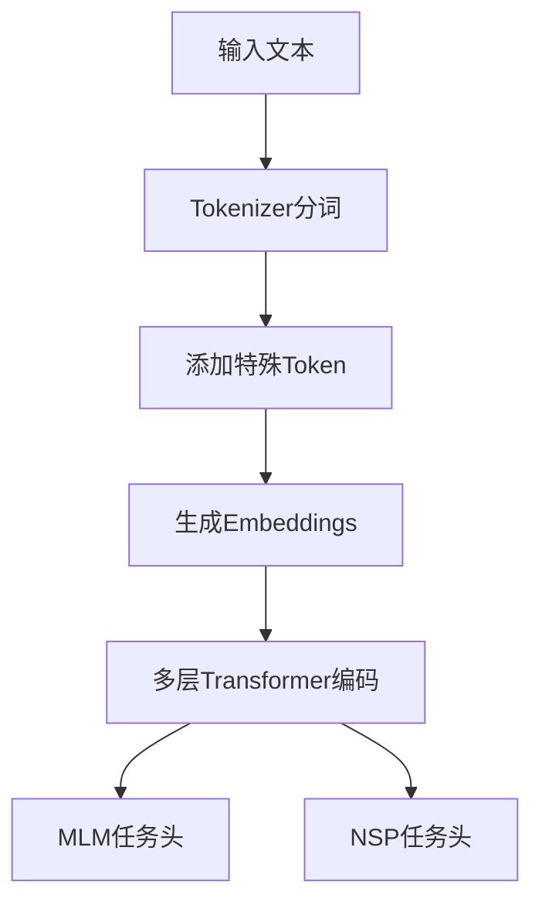
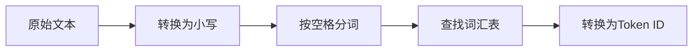
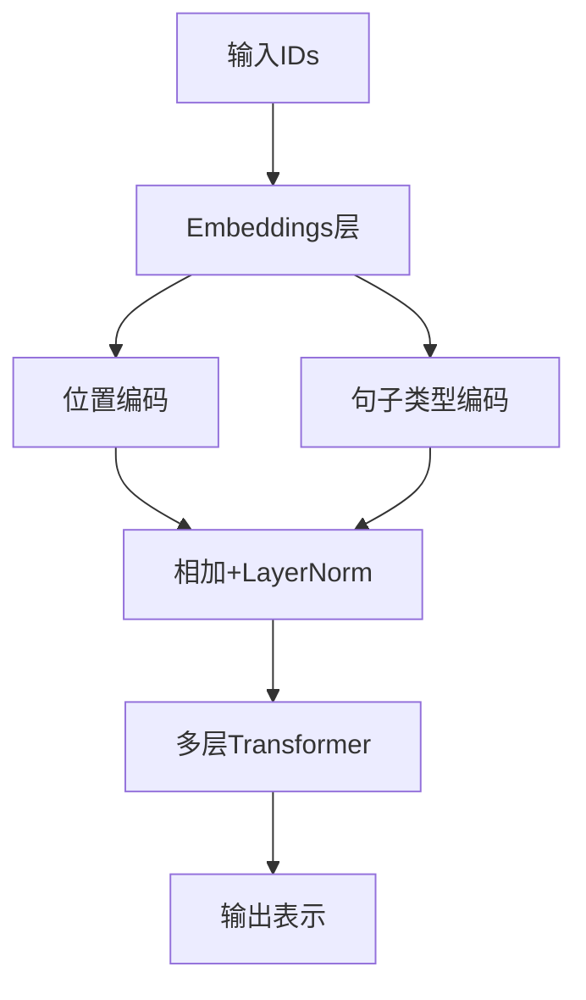
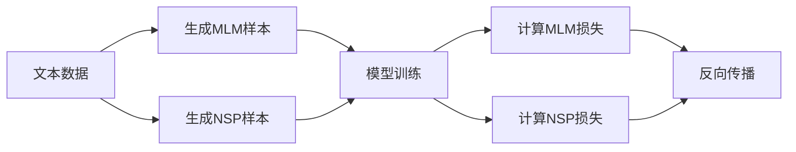
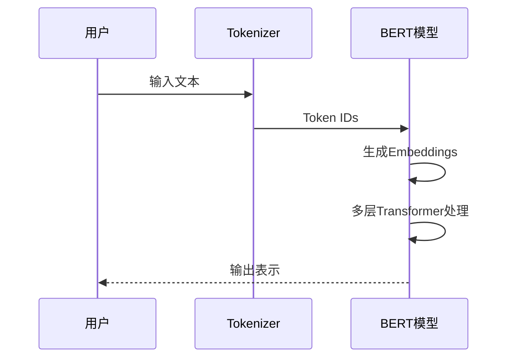

# BERT实现详解指南

## 1. BERT概述
BERT(Bidirectional Encoder Representations from Transformers)是一种基于Transformer架构的预训练语言模型。它的核心特点包括：
- 双向上下文理解
- Masked Language Model(MLM)预训练任务
- Next Sentence Prediction(NSP)预训练任务
- 多层Transformer编码器



## 2. 文件结构说明
本项目包含以下核心文件：
- `config.json`: 模型配置文件
- `tokenizer.py`: 分词器实现
- `model.py`: BERT模型实现
- `train.py`: 训练脚本
- `vocab.txt`: 词汇表文件

## 3. 文件详细解析

### 3.1 config.json
```json
{
  "vocab_size": 30522,        // 词汇表大小
  "hidden_size": 768,         // 隐藏层维度
  "num_hidden_layers": 12,    // Transformer层数
  "num_attention_heads": 12,  // 注意力头数量
  "intermediate_size": 3072,  // 前馈网络中间层维度
  "hidden_act": "gelu",       // 激活函数类型
  "hidden_dropout_prob": 0.1, // 隐藏层dropout概率
  "attention_probs_dropout_prob": 0.1, // 注意力dropout概率
  "max_position_embeddings": 512, // 最大位置编码长度
  "type_vocab_size": 2,       // 句子类型数量
  "initializer_range": 0.02    // 参数初始化范围
}
```

### 3.2 tokenizer.py
实现WordPiece分词算法(简化版)，主要功能：
- 加载词汇表
- 文本分词
- Token与ID互相转换



### 3.3 model.py
包含BERT核心组件：
- `BertEmbeddings`: 组合词嵌入、位置嵌入和句子类型嵌入
- `BertSelfAttention`: 多头自注意力机制
- `BertLayer`: 单层Transformer编码器
- `BertModel`: 完整的BERT模型



### 3.4 train.py
实现BERT预训练流程：
1. 准备数据集
2. 初始化模型
3. 定义优化器
4. 训练循环(MLM + NSP)



### 3.5 vocab.txt
词汇表文件示例：
```
[PAD]  # 填充token
[UNK]  # 未知token
[CLS]  # 分类token
[SEP]  # 分隔token
[MASK] # 掩码token
这
是
一个
bert
模型
...
```

## 4. 整体工作流程
1. 文本输入
2. Tokenizer处理
3. 生成Embeddings
4. 多层Transformer编码
5. 输出上下文表示



## 5. 训练过程详解
BERT预训练包含两个任务：
1. Masked Language Model(MLM):
   - 随机mask 15%的token
   - 预测被mask的原始token

2. Next Sentence Prediction(NSP):
   - 判断两个句子是否连续
   - 二分类任务

训练步骤：
1. 准备数据
2. 前向传播
3. 计算损失(MLM + NSP)
4. 反向传播
5. 参数更新

## 6. 关键概念图解

### 6.1 BERT模型架构


### 6.2 注意力机制


### 6.3 预训练任务

